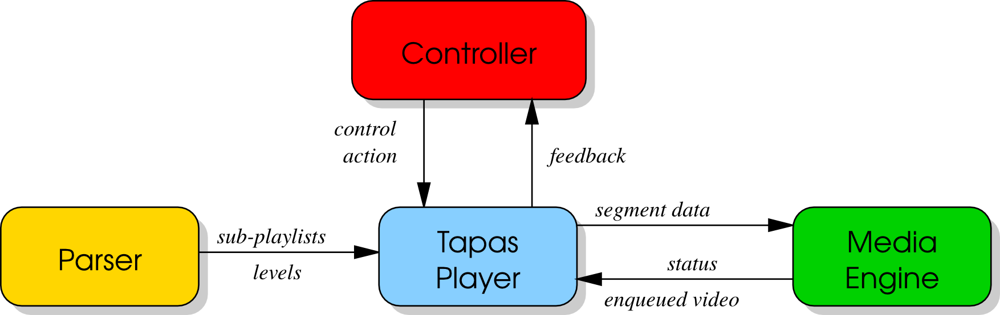

.. TAPAS documentation master file, created by Vito Caldaralo
   sphinx-quickstart on Tue Sep  9 11:39:28 2014.
   You can adapt this file completely to your liking, but it should at least
   contain the root `toctree` directive.

TAPAS documentation - Tool for rApid Prototyping of Adaptive Streaming algorithms
=================================================================================

TAPAS is an open-source Tool for rApid Prototyping of Adaptive Streaming control algorithms. It is a flexible and extensible video streaming client written in Python that allows to easily design and carry out experimental performance evaluations of adaptive streaming controllers without needing to write the code to download video segments, parse manifest files, and decode the video stream. 
TAPAS currently supports DASH and HLS and has been designed to minimize the CPU and memory footprint so that experiments involving a large number of concurrent video flows can carried out using a single client machine.

Architecture
------------

`TapasPlayer`_ is implemented by aggregation of three interacting components: 
	1) the `Controller`_ that selects the video level of the next segment to be downloaded; 
	2) the `Parser`_, that parses the video manifest file; 
	3) the `MediaEngine`_ that stores the downloaded video in the playout buffer and plays the video. 
Each of these three components can be extended individually by inheriting the corresponding base class. Moreover, it is worth to mention that `TapasPlayer`_ includes an extensible module that periodically logs in a file the variables of interest.

.. _TapasPlayer: tapasPlayer.html
.. _Controller: controller.html
.. _Parser: parser.html
.. _MediaEngine: mediaEngine.html

.. code-block:: python
   :linenos:

   c = Controller(ctrl_options)
   p = Parser(url_playlist)
   m = MediaEngine(media_options)
   player = TapasPlayer(controller=c, parser=p, media=m, other_options)
   player.play()

.. toctree::
   :maxdepth: 1

   tapasPlayer
   controller
   parser
   mediaEngine

Usage
-----

Play a default playlist: ::
    
    $ python play.py

Play a default playlist with a "conventional" adaptive controller: ::
    
    $ python play.py -a conventional

Play a YouTube playlist: ::
    
    $ python play.py -u "https://www.youtube.com/watch?v=XSGBVzeBUbk"

Play a Rai.tv playlist: ::

    $ python play.py -u "http://www.rai.tv/dl/RaiTV/programmi/media/ContentItem-b1a0effc-bba0-472d-bb43-d4cd7c3a8a39.html"
    
    $ python play.py -u "http://mediapolis.rai.it/relinker/relinkerServlet.htm?cont=308709"

Play a playlist for logs, without decoding video: ::

	$ python play.py -m nodec

Play a playlist with a fake player (emulated playout buffer and no decoding): ::

	$ python play.py -m fake

Play only the highest quality of the playlist: ::

	$ python play.py -a max

Player options: ::

	$ python play.py --help

Enable debug: ::
    
    $ DEBUG=2 python play.py

Indices and tables
==================

* :ref:`genindex`
* :ref:`modindex`
* :ref:`search`

