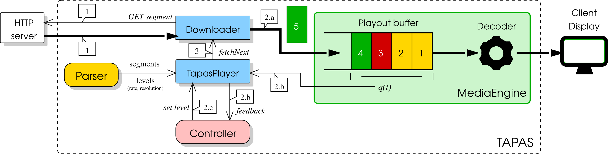

TapasPlayer
===========

When the `TapasPlayer`_'s ``play()`` method is issued the `Parser`_ downloads the manifest and populates two lists of dictionaries ``playlists`` and ``levels``: the first one maintains information about segments (or chunks), the second one holds video levels (or representations) information. The two lists of dictionaries are then passed to the player. 
At this point two concurrent threads are started: 1) a thread that fills the playout buffer by fetching the video segments from the HTTP server and 2) a thread that drains the playout buffer to play the videostream.
Let us now focus on the thread that fills the buffer. The following operations are executed in a loop until the last video segment has been played:
	1) The ``Downloader`` fetches from the HTTP server the current segment at the selected video level. 
	2) When the download is completed the following operations are performed:
		(a) The segment is enqueued in the playout buffer handled by the `MediaEngine`_ component.
		(b) The player gets from the `MediaEngine`_ the queue length and other feedbacks and builds the player ``feedback`` dictionary with this information. Then player ``feedback`` is passed to the `Controller`_.
		(c) The `Controller`_ computes two values: 1) the control action, i.e. the video level rate of the next segment to be downloaded; 2) the idle duration, possibly equal to zero, that is the time interval that has to elapse before the next video segment can be fetched.
	3) A timer of duration ``idle duration`` is started. When the timer expires the loop repeats from step 1.
Finally, the thread draining the playout buffer is handled by the `MediaEngine`_ that decodes the compressed video frames, and plays the raw video.

.. _Controller: controller.html
.. _Parser: parser.html
.. _MediaEngine: mediaEngine.html

Methods
-------

.. autoclass:: TapasPlayer.TapasPlayer
   :members: